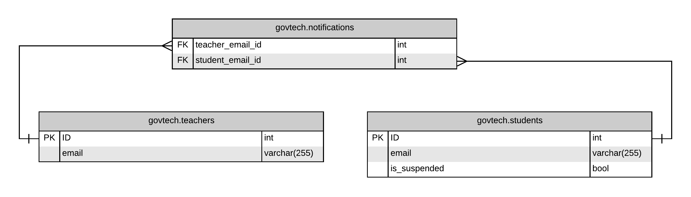

# Introduction

GovTech assignment for Parents Gateway

# Table Schema

# Requirements to run locally

    Docker
    Docker-compose

To run locally, docker and docker-compose must be installed.
With docker and docker-compose, run the command `docker-compose up` to deploy the services locally.

# Postman

[Postman collection](./media/pgateway.postman_collection.json) to test apis
